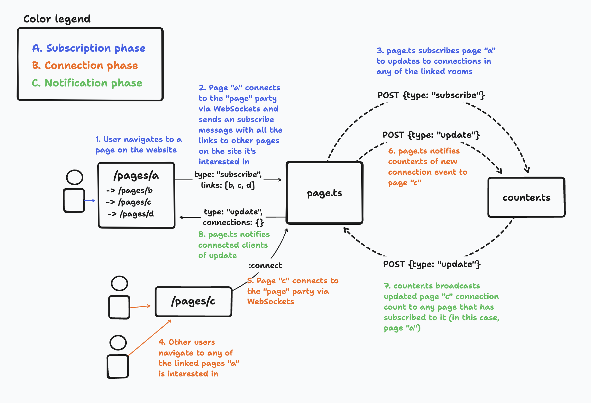

## 🎈 connection-counter

This is a [Partykit](https://partykit.io) application, demonstrating an advanced use of [multi-party communication](https://docs.partykit.io/guides/using-multiple-parties-per-project/).

## Demo

The [demo](https://connection-counter.jevakallio.partykit.dev) is a website that shows how many people are currently viewing any of the pages linked from the the current page. 

## Architecture

This example app consists of two PartyKit parties:

### counter.ts

- We create one global instance of this party for the whole application
- Keeps track of current connection counts for all pages in the app
- When [**page.ts**](#pagets) sends an `"update"` request to this party, it notifies each subscribed [**page.ts**](#pagets) party instance of the latest update count
- Communicates with the [**page.ts**](#pagets) party via HTTP POST messages

### page.ts

- We create a room for each unique page id within the site
- When a user sends a `"subscribe"` WebSocket message with a list of linked page ids, sends a message to the [**counter.ts**](#counterts) party to subscribe itself to updates
- When a user connects to this room via WebSockets, it notifies the **counter.ts** room of the current connection count

### Party-to-party communication

The below diagram shows the data flow between user, the [**page.ts**](#pagets) party, and the [**counter.ts**](#counterts) party.

### Storage

- [**counter.ts**](#counterts) persists state to party storage, and cleans inactive rooms once per hour.
- [**page.ts**](#pagets) persists state to party storage, and deletes its storage after one hour of inactivity.

### Further optimization opportunities

- [**page.ts**](#pagets) sends a subscription message on every connection, even when it's already subscribed. This is useful for when page links update, but causes unnecessary chattiness.

